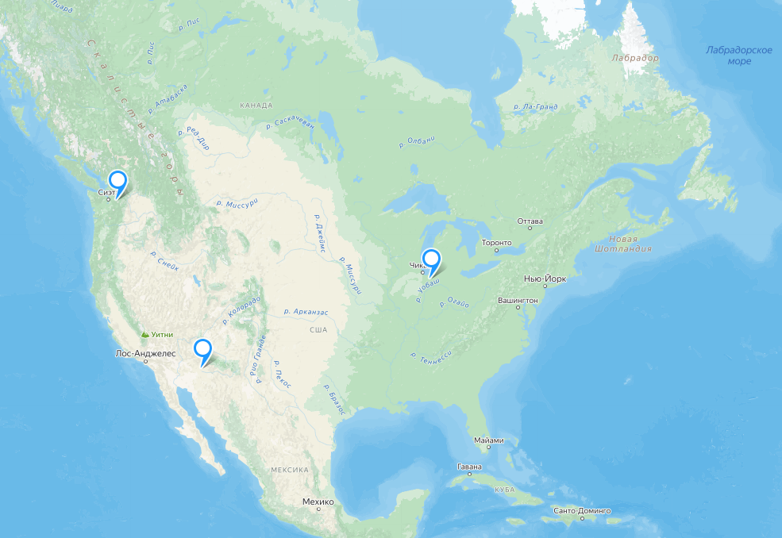
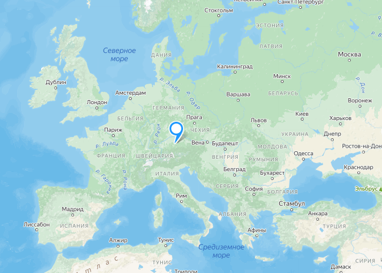
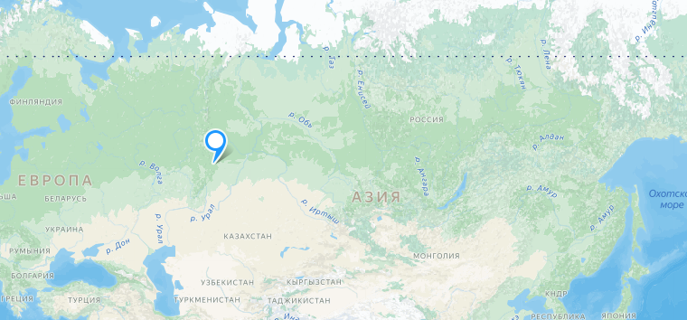
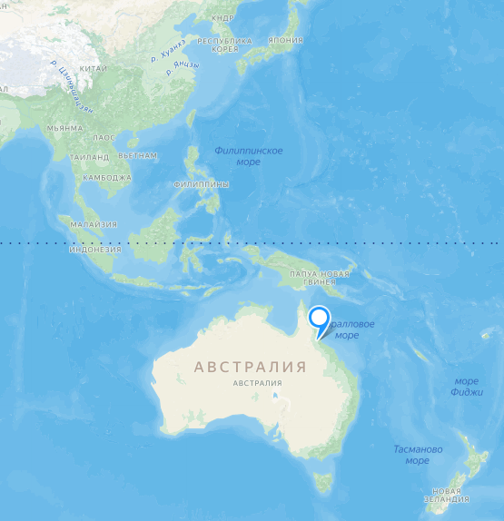
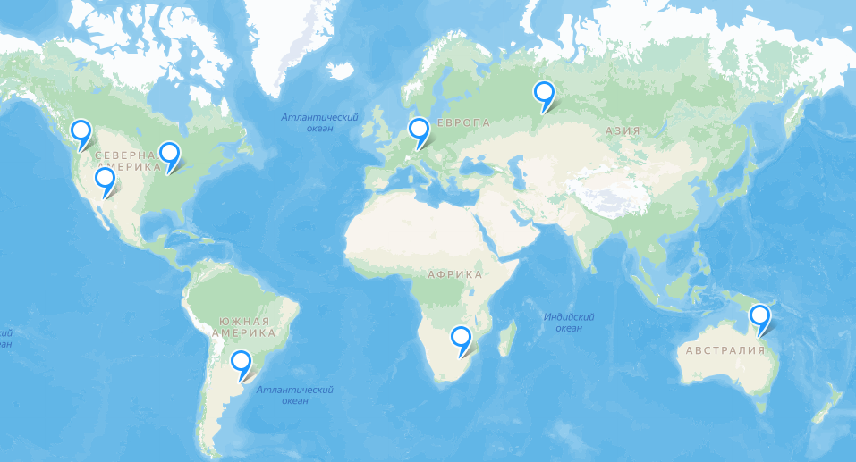
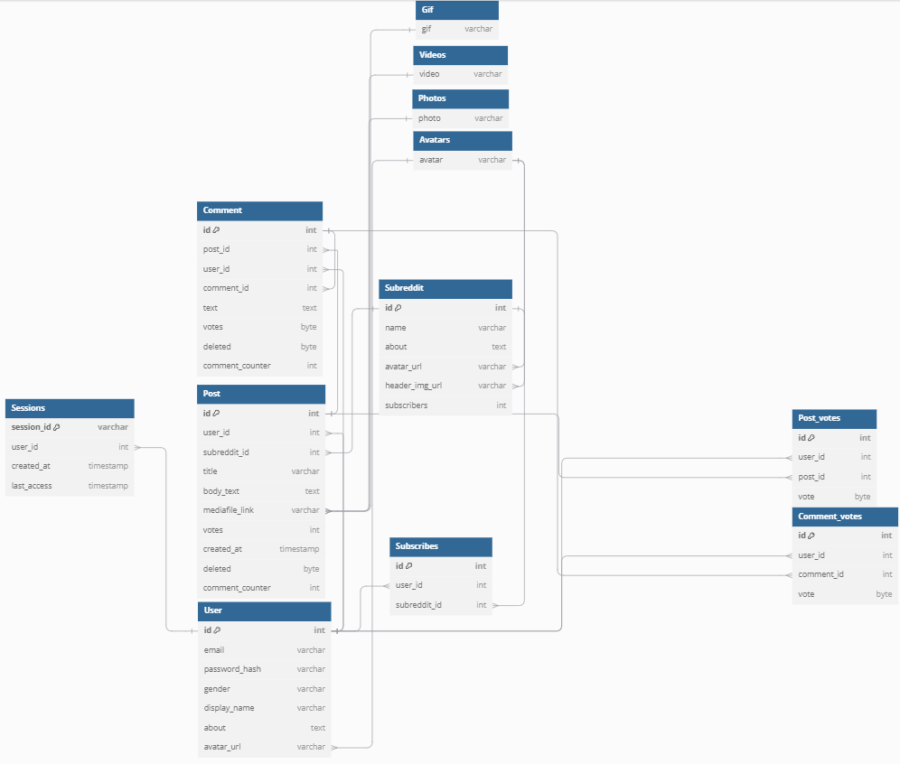
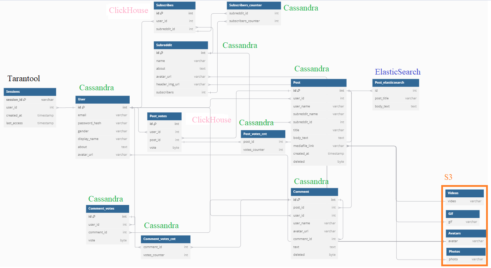
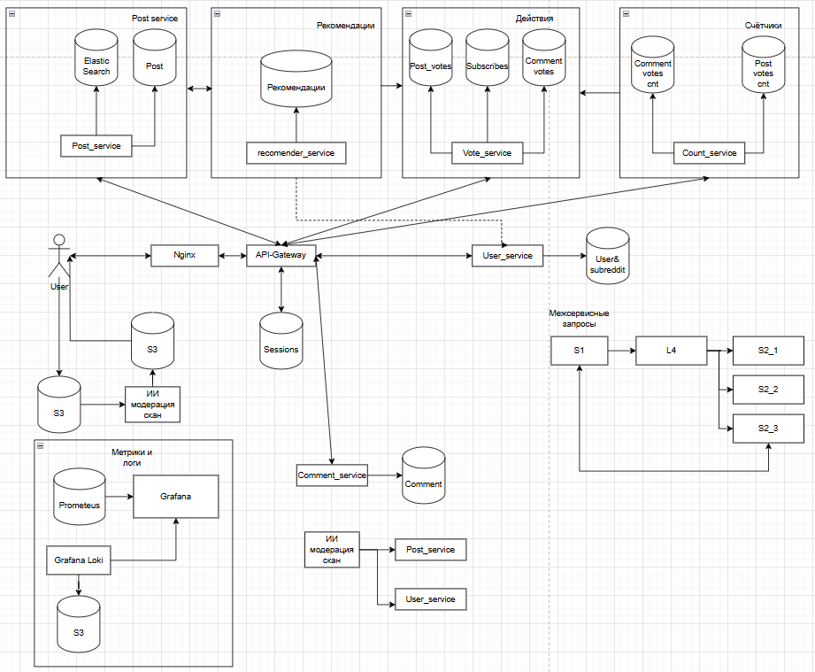

# highload

## [Reddit](https://www.reddit.com/)

* ### [1. Тема, целевая аудитория](#1)
* ### [2. Расчёт нагрузки](#2)
* ### [3. Глобальная балансировка нагрузки](#3)
* ### [4. Локальная балансировка нагрузки](#4)
* ### [5. Логическая схема БД](#5)
* ### [6. Физическая схема БД.](#6)
* ### [7. Алгоритмы.](#7)
* ### [8. Технологии](#8)
* ### [9. Обеспечение надёжности](#9)
* ### [10. Схема проекта](#10)

### 1. Тема и целевая аудитория 

**Reddit** является популярным сайтом, на котором пользователи могут создавать посты, участвовать в обсуждениях, подписываться на каналы. Ближайшие аналоги Reddit'а - Lemmy, Quora, 4chan[1].
Ежедневная аудитория Reddit'а состовляет 70 миллионов, при этом большая часть активных пользователей - 47% (26.4 млн) жители США [2].

Распределение пользователей по странам:
| Страна  | Процентное соотношение |
|---------|-----------------------:|
|США  |	47.8%                      |
|Великобритания  |	7.6%           |
|Канада  |	7.6%                   |
|Австралия    |	7.6%               |
|Германия    |	7.6%               |
|Остальные    |	29.9%              |

Распределение пользователей по возрастам:
| Возраст | Процентное соотношение |
|---------|-----------------------:|
|18 – 29  |	36%                    |
|30 – 49  |	22%                    |
|50 – 64  |	10%                    |
|65+      |	3%                     |

MVP функционал:
1. Создание и управление постами.
2. Сообщества
3. Комментарии.
4. Система голосования/оценки.
5. Выдача ленты контента.
6. Поиск постов.
7. Регистрация.

Ключевые продуктовые решения:
1. Система голосования, влияющая на порядок отображения.
2. Генерирование ленты с учетом предпочтений пользователя.
3. Уведомление пользователя о новых постах в сообщетсвах, ответах.

Список источников:
1. [19 best sites like Reddit 2024](https://rigorousthemes.com/blog/best-reddit-alternatives/)
2. [14+ Reddit Statistics For 2024](https://www.demandsage.com/reddit-statistics/).

### 2. Расчет нагрузки 

Продуктовые метрики:
1. Месячная аудитория (MAU) - 2.306 миллиарда [1],
2. Дневная аудитория (DAU) - 62.24 миллиона [1],
3. Для пользователей не предусмотрено выделение личного пространства на диске.
4. Согласно различным источникам [2] [3] [4], зарегистрированные пользователи в среднем проводят 20 минут на площадке, при этом просматривая 2.84 страницы [4]. 
Предположим, что пользователь в среднем просматривает 30 постов. Примем, что у 60% постов есть фотография в посте, среднее количество занков в посте - 200, фидео встречается в каждом десятом посте, а гиф - каждом двадцатом.
Тогда средний пост весит 200Б + 0.6*avg_img, + 0.1*avg_video, + 0.05*avf_gif = 200 + 0.6*80К + 0.1*5М + 0.05 * 300К ~ 0.55МБ. 
За год публикуется порядка 2-ух миллиардов комментариев [3], то есть в среднем пользователь в месяц публиукет 0.09 комментарий, в день это 0.003. 
Согласно [5] каждый месяц создаётся около 11 млн постов, это в среднем 0,00016 постов на пользователя в день. 
Согласно [3] в год регистрируется порядка 50 миллиардов голосований, это 1,8 оценок в день на пользователя. 
Комментарии также загружаются страницами. В страницу комментариев входят также пользователи и их данные (аватар, имя). 
Предположим, что пользователь в день также загружает 3 страницы комментариев, средний вес которой 13 КБ (измерено по запросу), вес одного комментария в среднем 0.5 КБ, 
производит 0.5 запросов поиска и 1 раз посещает сообщество в день, а также подписывается (или отписывается) на сообшество 1 раз в месяц. 

Среднее количество действий пользователя по типам в день (единиц в день):
|Действие|Количество в день|
| ------ | -------- |
| Создание поста | 0.00016 |
| Создание сообщества | ~0 |
| Посещение сообщетсва | 1 |
| Подписка/отписка на сообщество | 0.03 |
| Комментирование | 0.003 |
| Оценка | 1.8 |
| Выдача ленты контента | 2.84 |
| Поиск постов | 0.5 |
| Регистрация | ~0 |
| Загрузка постов | 71 |
| Загрузка комментариев | 3 страницы (~60 комментариев) |

Технические метрики:
1. Существенными блоками данных являются аккаунты пользователей и перечисленные ранее посты, комментарии и оценки. Аккаунт содеаржит аватар (80 КБ), описание, подписки, положим, что вся информация о пользователе требует в стреднем 90 КБ. Положим, что в среднем текст поста состовляет 500 знаков, фото занимает 50 КБ, gif - 200 КБ, видео ~750 КБ. 

Размер оценки: для хранения данных используется 16-байтный uuid. Итого для оценки используется uuid пользователя и сущности и boolean (допустим, boolean весит 1 байт). Итого одна оценка весит 33 байта.

| Блок | Штук | Вес | Всего |
| ---- | ---- | --- | ----- |
| Посты (всего) | 11 000 000 [5] * 12 * (2024-2005) = 2 508 000 000| 0.55 МБ | ~1 316,7 ТБ |
| Текст поста | ~ количесвто постов | 0.5 КБ | ~1.2 ТБ |
| Фото поста | ~0.6 постов | ~85 КБ | ~120 ТБ |
| GIF поста | ~0.4 постов | 512 КБ | ~478.8 ТБ |
| Видео поста | ~0.1 постов | 7.5 МБ | ~1 800 ТБ |
| Комментарии | 2e9 * (2024-2005) = 38e9| 0.25КБ | ~8.85 ТБ |
| Оценки | 50e9 * (2024-2005) = 0.95e12 | 33 Б | ~28.5 ТБ |
| Аккаунты | 0.5e9[2] | 90КБ | ~45ТБ |

Общий объём хранимый данных ~1 400 ТБ.

2. Сетевой трафик

|  Тип  | Нагрузка для одного пользователя  | Общая (в сутки)   | Сердняя (в секунду)   | Пиковая (в секунду) (x5)  |
| ---   | --------------------------------  | -------------     | -------------------   | ---                       |
| Загрузка ленты постов | 30 * 0.55МБ       | 893 ТБ            | 10.9 ГБ               | 54,5 ГБ                   |
| Создать пост          | 0.00016 * 0.55МБ     | 0.0055 ТБ      | 0.0000676 ГБ          | 0.00033 ГБ                |
| Подписка на сообщество| 0.003 * 0.1КБ     | 0.00002 ТБ        | 0.3 КБ                | 1.5 КБ                    |
| Загрузить комментарии | 3 * 60 * 0.25КБ   | ~2.6 ТБ           | 0.03 ГБ               | 0.15 ГБ                   |
| Оценка                | 1.8 * 0.1КБ       | 0.01 ТБ           | 0.0001 ГБ             | 0.0005 ГБ                 |

Суммарная нагрузка в сутки - 4 203 ТБ, в секунду - 51.5 ГБ, пиковая в секунду - 257.7 ГБ

3. RPS.

| Блок | На одного пользователя в сутки | Итого в секунду средний   | Итого в секунду пиковый (x5)  |
| ---- | ----                           | ---                       | ---                           |
| Загрузка ленты постов | 2.84          | ~2 000                    | 10 000                        | 
| Загрузить комментарии | 3             | ~2 200                    | 11 000                        |
| Поиск                 | 0.5           | ~360                      | 1 800                         |
| Создание поста        | 0.00016       | ~0.12                     | 0.6                           |
| Загрузить сообщество  | 1             | ~720                      | 3 600                         |
| Комментировать        | 0.003         | ~2.2                      | 11                            | 
|Оценить                | 1.8           | ~1 300                    | 6 500                         |
|Итого                  | 9.2           | ~6 600                    | ~33 000                       |

4. Прирост.

Прирост основных сущностей был описан в пункте 4 продуктовых метрик: ~ 167 млн комментариев, 11 млн постов, ~ 4 167 млн оценок ежемесечно. По предположению [2] к 2028 году будет 556 миллионов зарегистрированных пользователей, то есть прирост ~1.15 млн в месяц (сейчас начситывается 500 млн). На основе этих данных составлена таблица месячного прироста

| Сущность  | Прирост (штуки)   | Вес   | Прирост (данные)  |
| --------- | ----------------- | ----- | ----------------  |
| Комментарии | 167e6        | 0.25 КБ  | 0.04 ГБ           |
| Посты     | 11e6              | 1 МБ  | 10 750 ГБ         |
| Оценки    | 4.167e6           | 33 Б  | 0.13 ГБ           |
| Пользователи | 1.15e6         | 90 КБ | 0.1 ГБ            |

Итого прирость данных составляет 10 750.27 ГБ ежемесячно.

Список источников:
1. [Reddit User Base & Growth Statistics: How Many People Use Reddit? (2024)](https://www.bankmycell.com/blog/number-of-reddit-users/)
2. [Reddit User Age, Gender, & Demographics (2024)](https://explodingtopics.com/blog/reddit-users)
3. [Significant Reddit Statistics 2024: Facts & Figures, Usage Statistics](https://bytegain.com/reddit-statistics/)
4. [Latest Reddit Statistics: The SECRET Social Media Platform](https://www.ileeline.com/reddit-statistics/)
5. [20+ Riveting Reddit Statistics [2023]](https://www.zippia.com/advice/reddit-statistics/)
6. [How many subreddits are on Reddit?](https://wegotthiscovered.com/social-media/how-many-subreddits-are-on-reddit/)

### 3. Глобальная балансировка нагрузки 

1. Распределение трафика на группы.

Трафик можно разделить на 2 основные группы: выдача медиа (посты (в том числе фото, видео, gif), комментарии), и остальное. Поскольку Reddit подразумевает в основном выдачу статики (текст, фото, видео), то для этих целей разумно использовать CDN. Для CDN можно использовать поддомен или отдельный домен, или использовать готовые решения, например, Amazon CloudFront. Для создания постов, комментариев, аккаунтов, подписок CDN не потребуется.

2. Расположение датацентров.

Распределение RPS по странам:

| Страна    | RPS                   |
|---------  |----------------------:|
|США        |	3150                |
|Великобритания  |	500             |
|Канада     |	500                 |
|Австралия  |	500                 |
|Германия   |	500                 |
|Остальные  |	1970                |

Рассчитываем количество датацентров, исходя из того, что на один датацентр полагается порядка 1000-1500 RPS.

США. Расположим датацентры в США с учётом плотности населения:

На карте видно, что заселение на восточном побережье и части западного побережья плотнее, чем в центральной части. Расположим датацентры с учётом плотности населения и карты расположения АЭС для обеспечения стабильной энергией [1]. Один датацентр рисполодим на границе с Канадой, что позволит не располагать дополнительный датацентр в другой стране.

Всего получилось 3 датацентра.

Для старн европы выделим 1 датацентр, по RPS этого хватит. Расположим датацентр в Мюнхене у АЭС. Территориально это близко к центру Европы и обеспечит низкую задержку для основных стран Европы: Германия, Франция, Великобритания.

Для стран Азии и России, расположим ДЦ в Екатеринбурге.

Австралия. Для Австралии принято решение расположить ДЦ на севере страны, поскольку есть необходимость обеспечить более быстрым соединением такие страны, как Япония, но располагать ДЦ на островах плохая идея из-за недостпуности и неразвитой инфраструктуры, а расплогалать в Японии ненадёжно из-за частых замлетрясений, которые могут сопровождаться отключением электричества.

Весь мир. Отсальные регионы равномерно покрыты датацентрами.

[Примерная карта датацентров](https://yandex.ru/maps/?ll=38.353354%2C25.216488&mode=usermaps&source=constructorLink&um=constructor%3A6f3f0d5f20e86332fae7f1b4a40f52184158eb986e23d8d44e151d4904ef01a8&z=3)

3. Схема глобальной балансировки.

Для США и Канады используется связка Geo-based DNS и BGP Anycast, поскольку в стране представлено несколько ДЦ, выбор которого предстоит за скоростью ответа (anycast). Для остальных стран использовуется Latency-based DNS.

Список источников:
1. [АЭС США](https://www.google.ru/maps/d/viewer?mid=1umnxGzgI_zQ1PKH4nZzWwtou6OQ&hl=ru&ll=41.805326407227724%2C-76.13027336795477&z=7)

### 4. Локальная балансировка 

1. Выбрать схемы балансировки для входящих и межсервисных запросов.

Межсервисные запросы.

Для балансировки межсервисных запросов используется балансировка L4 Virtual Server via IP Tunneling, поскольку это не будет нагружать балансер как при использовании схемы Virtual Server via NAT. Также данный вид балансировки позволяет располагать сервера в разных физических сетях.

Входяие запросы.

Поскольку Reddit - сервис, на котором основной задачей является выдача статики (медиаконтента), то для входящих запросов используется балансировка L7 при помощи Ngnix. Ngnix будет использоваться как промежуточный прокси. Таким образом, будет обеспечиваться равномерная нагрузка на сервера при помощи least-connection. При это Ngnix будет выполнять ещё ряд важных функций, такие как: отдача статики, кеширование запросов, сжатие gzip, решение проблемы медленных клинтов и терминация SSL.

2. Продумать схему отказоустойчивости.

Для обеспечения отказоустойчивости используется keepalived, который позволяет обеспечить резервирование нод и отслеживать состояние узлов системы.

Также для обеспечения отказоустойчивости Ngnix балансировщики дублированы, тем самым при отказе одного балансировщика, его заменяет дублирующий.
Также можно на Ngnix использованы различные настройки для разных типов запросов, чтобы снизить ожидание разрыва соединения при нерабочем сервере, при этом не прерывая "живые" соединения.

Предлагается также производить аркестрирование серверов при помощи Kubernetes, осуществляя auto-scaling

3. Рассчитать нагрузку по терминации SSL

Терминация SSL будет происходить на Ngnix балансировщике, далее запросы на сервера будут передаваться по http. Чтобы снизить нагрузку по терминации SSL предлагается использовать session ticket для хранения состояния сессии на клиенте 

### 5. Логическая схема БД. 

[Схема](https://dbdiagram.io/d/Copy-of-Untitled-Diagram-6715e25a97a66db9a3a90e80)

Описание таблиц:

| Название таблицы  | Описание  |
| ----------------- | --------- |
| User              | Таблица для хранения информации о пользователе |
| Sessions          | Таблица для хранения сессий                   |
| Subscribes        | Таблица для хранения подписок пользователя на Subreddit |
| Subreddit         | Таблица для хранения данных о сообществе (Subreddit) |
| Post              | Таблица для хранения информации о посте |
| Post votes        | Таблица для хранения оценок постов |
| Comment           | Таблица для хранения комментариев |
| Comment votes     | Таблица для хранения оценок комментариев |
| Videos            | S3 для видео  |
| Photos            | S3 для фото   |
| Avatars           | S3 для аватаров |
| Gif               | S3 для gif    |

Медиафайлы предлагается хранить в S3.

Кешированию подвергать популярные посты и использовать буферы для запросов на запись, таких как комментарии и оценки.

Размеры таблиц:

| Таблица   | Размер для одной записи   | Кол-во записей    | Всего |
| --------- | ------------------------- | ------------      | ----- |
| User      | (4:id + 256:email + 60:password + 6:gender + 50:display_name + 200:about + 256:avatar_url)Б = 832 Б | 0.5e9 | 387,43 ГБ |
| Sessions  | (256:session_id + 4:user_id + 8:created_at + 8:last_access)Б = 276Б | 0.5e9 | 128,5 ГБ |
| Subscribes| (4:id + 4: user_id + 4:subreddit_id)Б = 12 Б | ~2.5e9 | 27,94 ГБ |
| Subreddit | (4:id + 500:about + name:21 + 256:avatar_url + 256:header_img_url + 4:subscribers)Б = 1041 Б | 10e6 | 0,97 ГБ |
| Post      | (4:id + 4:user_id + 4:subreddit_id + 300:title + 500:body_text + 256:mediafile_link + 4:votes + 8:created_at + 1:deleted + 4:comment_count)Б | 2.5e9 | 2 514 ГБ |
| Comment   | (4:id + 4:user_id + 4:post_id + 4:comment_id + 500:text + 1:deleted + 4:comment_count + 4:votes)Б = 520Б | 38e9 | 18 400 ГБ |
| Post_votes| (4:id + 4:user_id + 4:post_id + 1:vote)Б = 13Б | 550e9 | 6 659 ГБ |
| Comment_votes| (4:id + 4:user_id + 4:comment_id + 1:vote)Б = 13Б | 400e9 | 4 843 ГБ |
| Videos            | 750 КБ  | 2.5e8 | 175 ТБ |
| Photos            | 50 КБ   | 1.5e9 | 20 ТБ |
| Avatars           | 50 КБ   | 0.5e9 | 6.6 ТБ |
| Gif               | 200 КБ  | 1e9   | 954 ГБ |

Нагрузка на чтение/запись:
| Название таблицы  | RPS всего |Тип нагрузки   |
| ----------------  | -----     |-------------- |
| User              | 2200: Загрузить комментарии + 2.2:комментировать + 1300 оценить + 0.12:создание поста = 3502.32 | Чтение |
| Sessions          | 717.6 (из DAU) | Чтение > Запись |
| Subscribes        | <<1       | Запись\Чтение |
| Subreddit         | 2000:загрузка ленты постов + 720:Загрузить сообщество + 0.12:создание поста = 2720.12 | Чтение |
| Post              | 2000:Загрузка ленты постов + 2.2:комментировать + 800:оценить + 0.12:создание поста = 2802.32 | Чтение >> Запись |
| Comment           | 2200:загрузить комментарии + 2.2:комментировать + 500:оценить = 2702.2 | Чтение >> Запись |
| Post_votes        | 800:оценить | Запись >> Чтение|
| Comment_votes     | 500:оценить | Запись >> Чтение|  

### 6. Физическая схема БД. 

Проведенние денормализации.
Созданы следующие таблицы:
1. Post_votes_cnt - для избежания пересчета голосов поста, что влечёт массовые join'ы.
2. Comment_votes_cnt - преследует те же цели.
3. Добавление избыточной информации в таблицы Постов, Комментариев. Теперь отображаемая информация об авторе (в случае постов и сабреддите) дублируется, что избавляет от join'ов.
4. Добавление счётчика подписчиков Subscribers_counter для Subreddit и соответствующего поля. Поскольку запрос сабреддита повлечет подсчёт подписчиков, что перегрузит таблицу подписок (Subscribes) 

Хранение всей статической информации реализовано при помощи S3 хранилища. Хранение сессий реализовано при помощи tarantool, поскольку является in-memory БД, позволяет обрабатывать запросы с высокой скоростью записи и чтения и имеет возможность восстановиться в отличие от Redis. Требует использования большого количества инстансов.
Основные сущности (Пользователи, Посты, Комментарии, Сабреддиты) хранятся при помощи Cassandra, поскольку она спроектирована под высокую нагрузку на чтение, имеет соотвествующие встроенные механизмы, такие как шардинг.
Для хранения Subscribes и Post_votes используется Druid для последующей аналитики для составления рекомендаций. 

Druid vs ClickHouse. [1,2]
1. ClickHouse <b>поддерживает</b> пакетные вставки напрямую, в отличие от Druid.
2. Druid <b>не поддерживает</b> точечные удаления и обновления данных, в ClickHouse это поддерживают движки Replacing и Сollapsing.
3. Druid требует поддержки хранение в файловой системе хранилища «глубокого хранения» сегментов.
4. ClickHouse не требует сервера метаданных. Метаданные копируются на все узлы. Секционированные таблицы можно загружать неравномерно (поддержка весов, выставляемых вручную).
5. В Druid хранение устроено сегментами, что сложнее в части управления данными чем в ClickHouse.
6. ClickHouse имеет готовое решение горизонтального масштабирования (линейная масштабируемость - расширяем кластер и получаем большую производительность).
7. Druid разделяет данные на сегменты по временной оси.

Из перечисленных пунктов можно заключить, что ClickHouse поддерживать будет проще, он более распространён, имеет выгодные в нашем случае преимущества (1, 4, 5, 6). Поэтому было решено использовать именно ClickHouse

Из-за болшого размера таблицы комментариев (~18 ТБ), храннеие её на одном диске невозможно, поскольку используются диски до 18 ТБ, поэтому проводится шардирование по post_id, т.к. комментарии вычитываются пачкой для отдельного поста. 

Таблицы.
| Название таблицы  | Индексируемое поле    |Применённая денормализация     | Выбранная СУБД        | Шардирование      | Реплицирование        |
| ----------------  | --------------------- | ----------------              | --------------------- | ----------------  | --------------------- |
| Sessions          | User_id               | -                             | Tarantool             | VShard(buckets)   | VShard(replicaset)    |
| User              | id, display name, email     | -                             | Cassandra             | -           | - |
| Subreddit         | id, name, about (полнотекстовый) Добавление счётчика subscribers | -           | Cassandra | -     | - |
| Subscribes        | user_id, subreddit_id | -                             | ClickHouse            | -                 | - |
| Post              | user_id, subreddit_id, id, created_at (b-tree) | Дублирование информации об авторе и сабреддите, запрос количества голосов отдельным запросом | Cassandra | - | Большое чтение |
| Comment           | post_id, parent_comment, {post_id, parent_comment=Null}| Дублирование информации о пользователе, внешний счётчик голосования | Cassandra   | post_id, так как таблица слишком большая   | Большое чтение |
| Comment_votes     | comment_id            | -                             | Cassandra             | comment_id (высокая запись) | - |
| Post_votes        | post_id, user_id      | -                             | ClickHouse            | -            | Реплика только для чтения |
| Post_votes_cnt    | post_id               | -                             | Cassandra             | - (постепенное обновление) | - |
| Comment_votes_cnt | comment_id            | -                             | Cassandra             | - (постепенное обновление) | - |
| Subscribers_counter| subreddit_id         | -                             | Cassandra             | - (постепенное обновление) | - |
| Post_elasticSearch| id                    | -                             | ElasticSearch         | -                 | -                     |
| videos/gif/avatars/photos | -             | -                             | S3                    | -                 | -                     |

Библиотеки: cassandra-driver tarantool-python Vshard

Балансировка запросов:
Cassandra: внутренние механизмы (шардирование)
Tarantool: VShard

Список источников:
[1. Расшифровка доклада Highload++ 2016 Виктора Тарнавского](https://habr.com/ru/articles/322724/)
[2. Сравнение открытых OLAP-систем Big Data: ClickHouse, Druid и Pinot](https://habr.com/ru/companies/oleg-bunin/articles/351308/)

### 7. Алгоритмы. 

<b>Алгоритм рекомендаций.</b>

Рекомендации будут формироваться асинхронно для каждого пользователя. Рекомендации формируются при помощи статистики пользователя, то есть тех постов, которые он лайкнул и сабреддитов, на которых происходит активное увеличение аудитории. Для рекомендации планируется использовать NoSQL DB, например, Cassandra. В подборе рекомендованных постов будет задействован ElasticSearch. С его помощью проводится поиск постов, схожих с лайкнутыми пользователем. Также в выборку попадают посты от того же пользователя/сабреддита, посты которого лайкал пользователь, и посты из набирающих популярность сабреддитов, схожими с интересами пользователя. Все подобранные рекомендации записываются в базу и потом запрашиваются при запросе рекомендаций.

<b> Модерация контента.</b>

Для модерации наиболее эффективным для обработки большого количества входных данных являются модели машинного обучения, поскольку добавление черных или белых листов избыточных подход, который требовал бы хранение всех запрещенных или разрешенных слов всех языков, это требовало бы хранения и постоянного чтения, а также обновления. Из-за данных минусов модерация большого количества текстового контента невозможно. Конечно, можно добавить некий первичный черный список слов, который производил бы первоначальную модерацию, но эти ограничения обычно обходятся символами. В случае обработки фотографий потребуется также некое сравнение загружаемой фотографии с фотографиями запрещённых объектов, что сложнее алгоритмически и также содержит минусы модерации текста черными и белыми списками.

Поэтому логичным решением является использование машинного обучения, поскольку распознавание (идентификация, классификация) являются стандартными операциями для данных моделей.
В случае, если будет принято решение разрабатывать модель самостоятельно, то можно воспользоваться python и фреймоврком PyTorch, загрузить запрещённые данные, обучить модель. Модель сама сформирует запрещённые признаки, после чего её можно использовать для модерации.

Также можно обратиться к компаниям, которые специализируются на подобных заказах, например, data-light. Она предлагает решение задач модерации при помощи ИИ.

Также в любом случае будет контент, который прошёл модерацию нейронной сетью. В этом случае обрабатываются жалобы пользователей, контент проверяется человеком. В случае, если контент дейстивтельно запрещён, он будет удалён модератором, а самими данными можно дообучать модель. Но в этом случае надо избежать переобучения модели, иначе возможна блокировка допустимого контента. В подобном случае можно подать апелляцию на проверку контента человеком.    

<b>Снижение качества для старого или непопулярного контента. </b>

Чтобы оптимизировать хранения медиаданных предлагается не только использовать стандартные методы хранения, такие как сжатие, но и ухудшение качества, поскольку эта информация невостребована для большого количества пользователей, а, учитывая предназначение Reddit (это больше про мемы), пользователю не критично сохранение его данных в оригинальном качестве (как если бы это был сервис для условного хранения семейных архивов, где важно качество).

Именно поэтому предлагается медиа в постах в непопулярных сабреддитах или от пользователей, чьи посты не набирают высоких оценок (в данном случае можно воспользоваться статистикой), подвергать ухудшению качества для оптимизации хранения (с учетом того, что большинство контента не является популярным, данный шаг позволит заметно сократить объёмы хранения).

Для непопулярного контента сжатие с ухудшением качества можно реализовать при помощи JPEG для фото и HEVC с высокими параметрами сжатия.

Для популярного - WebP и HEVC с низкими параметрами сжатия.

Для апскейла можно применить нейросети, например, ESRGAN, при этом апскейлинг можно выполнять с использованием облачных вычислений для экономии локальных ресурсов.

Это позволит оптимизировать хранение и повысить скорость загрузки редковыдаваемого контента (который не будет кэшироваться).

### 8. Технологии. 

| Технология    | Область применения    | Мотивационная часть   |
| ------------  | -----------------     | -------------------   |
| Go            | Backend               | Асинхронность, распространенность |
| TypeScript    | Frontend              | Распространенность, типизация (повышение надёжности)  |
| React         | Frontend              | Распространенность    |
| Cassandra     | Хранение данных (пользователи, посты, комментарии, сабреддиты и связанные с ними таблицы) | Встроенный шардинг, поддержка индексов, поддерживает высокий RPS  |
| ElasticSearch | Поиск постов          | Распространенное решение для организации поиска [1]  |
| Tarantool     | Хранение сессий       | In-memory БД, поддержка выского RPS, восстановление после перезагрузки    |
| Amazon S3     | Хранение медифайлов   | Готовое S3 хранилище, обеспечивающее хранение больших объемов данных. Отказоустойчивость и целостность данных обеспечивается Amazon   |
| Ngnix         | Балансировка          | Обеспечение отказоустойчивости при помощи дублирования, балансировка L7, терминация SSL   |
| kubernetes    | Оркестрация           | Распространенность |
| Docker        | Контейнеризация       | Распространенность, работа в связке с kubernetes  |
| Grafana-Prometheus    | Мониторинг    | Распространенность, наличие готовых dashboards    |
| Grafana Loki  | Логирование           | Часть системы Grafana. Loki индексирует не сами логи, а их метаданные, а именно метки. При этом сами логи сжимаются и хранятся в различных объектных хранилищах или в файловой системе.[3] | 
| ClickHouse         | Статистика            | Столбцовая СУБД, возможность быстрой записи пачками, сжатие данных, горизонтальное масштабирование из коробки [2]|

Список литературы:
1. [Сравнение elasticSearch с конкурентами](https://habr.com/ru/articles/581394/)
2. [ClickHouse, Druid, Pinot](https://habr.com/ru/companies/oleg-bunin/articles/351308/)
3. [Logging with Grafana](https://noobdevblog.hashnode.dev/logging-with-grafana)

### 10. Схема проекта. 

В качестве схемы проекта рассмотрена схема типа API-Gateway, поскольку данная схема позволяет использовать несколько запросов в рамках одного обращение. Это позволит разделить сервис на микросервисы для разделения нагрузки по ним. Например, при запросе поста необходимо сходить в несколько БД, где хранятся сами посты, лайки, комментарии. Если пользователь поставит оценку или запросит комментарии, то запрос опять придётся на этот микросервис, у него будет высокая нагрузка. Поэтому предлагается разделить это на микросервисы. К тому же это добавит отказоустойчивости, так как при сбое в одном микросервисе (например, для комментариев или оценок), пользователи получат деградацию сервиса, а не отказ.

Также необходимо собирать метрики и логи. Согласно заданию 8 для хранения логов используется S3 хранилище, для метрик - Prometeus.

Как ходят запросы:
1. Пользователь делает запрос, попадает на Ngnix, далее на API-Gateway. Аутентификацию пользователя выполняет сам API-Gateway при помощи простого запроса в базу сессий. Если пользователь создаёт аккаунт, то запрос перенаправляется в микросервис User_service.
2. Основной сценарий использования - запрос постов. В этом случае пользователь попадёт на Post_service. В случае запроса ленты рекомендаций, произойдёт межсервисный запрос к микросервису рекомендаций для выдачи id постов для конкретного пользователя из базы рекомендаций. После получения id постов Post_service произведёт выборку постов из БД и выдаст пользователю. В постах есть ссылки на файлы в хранилище S3, которые пользователь будет загружать напрямую.
3. Поиск постов - пользователь отправляет в соответствующий микросервис запрос, получает посты в результате поиска постов по ElasticSearch и вывода из БД Post.
4. Загрузка постов - помимо записи в таблицы Post и ElasticSearch вся медиаинформация проходит через ИИ модерацию, о которой велась речь ранее. Можно заменять файл, не прошедший модерацию на некий дефолтный, а сам файл и его url в s3 можно хранить в отдельной таблице. При выдаче поста пользователи не столкнутся с нежелательным контентом, а при успешной апелляции дотсаточно заменить файл в s3. В случае с текстовой модерацией можно блокировать запись. Допустим аналогичный подход - блокировка выдачи, для этого в таблицу постов необходимо добавить поле visible, которое определяет доступен ли пост для чтения другими пользователями.
5. В случае запроса комментариев пользовательский запрос отправится соответствующему сервису.
6. При выдаче постов и комментариев также производится запрос к сервису счётчиков для выдачи количества оценок.
7. Для подписок и оценок (действий пользователя) используется сервис действий.
8. Сервис счётчиков осуществляет межсервисные запросы к сервису действий для актуализации информации о появлении новых оценок для обновления счётчиков.
9. Сервис рекомендаций совершает запросы к сервису действий для поиска последних действий пользователя, формирует рекомендации при помощи elasicSearch post_service и сохраняет результаты в базе. Также для экономии времени вычисления можно реализовать логику, при которой рекомендации будут пересчитываться только для активных пользователей (например, если у пользователя нет активных сессий, он считается неактивным).
10. Сбор метрик и логов ведётся при помощи Prometeus и Loki, для их представления используется Grafana.

### 9. Обеспечение надёжности. 

Безопасность на физическом уровне ДЦ:
| Сфера     |   Меры    |
| ------    | -----     |
| Ранг ДЦ   | 4         |
| Расположение ДЦ | Близко к источникам питания, вырабатывающих мощность на протяжении всего дня (не солнечные панели в виду цикла выработки энергии и не ТЭС, так как требуется инфраструктура для подвоза, хранения горючего, а АЭС или ГЭС. В рамках данной работы рассматривались АЭС). Требования - наличие развитой инфраструктуры поблизости (дороги, близость к городу) для снижения времени доступности в случае ЧП, сетевые фильтры для предотвращения перегрузок |
| Внутреннее расположение | Разделение на зад/ряд/стойка/место  |
| Защита от перегрева   | Применение системы кондиционирования с разделением на горячие и холодные коридоры с применением фальщ-полов |
| Защита от погодных условий/протечек | Фальш-потолок   |
| Электропитание   | Дублирование линий и блоков питания    |
| Резервное электропитание | Генераторы |
| Сеть  | Дублирование роутеров, сетевых карт, сетевого оборудования    |
| Память    | Использование NVMe, так как требуется доступ к случайной памяти (посты, рекомендации, счётчики vote и cnt, комментарии и остальное), случайное чтение 150ns против 10ms у HDD. |
| Отказоустойчивость хранения | Raid 10 для постов, пользователей, сабреддитов - критичная информация, не занимающая большого объёма |

Балансировка:
| Вид | Описание |
| ---   | ---   |
| Глобальная | Geo-based + anycast для стран и регионов, где расоложено несколько ДЦ (США, Европа), Latency-based для отдаленных стран, CDN  |
| Локальная | L4 для межсервисных, L7 для входящих запросов, keepalived, k8s    |

Уровень сервисов:
| Вид   | Описание  |
| ---   | ----      |
| Резервирование БД | Описано в п.6 |
| Graceful shutdown | Сохранение всех данных при отключении |
| Graceful degradation | Предусмотрена такая работа логики, что при отказе компонентов пользователь получит только деградацию сервиса (например, разделение постов и комментариев)  |
| Outbox| Применение для счетчиков голосов: сначала голоса сохраняются батчем в базу votes, после чего в kafka отправляется событие о записи, после чего батч накатывается в счётчик cnt   |
| Circuit breaker [1] | failover policy - позволяет снять нагрузку с сервиса при недоступности одного микросервиса. Имеет 3 состояния: закрыт, когда всё работает; открыт, когда превышен лимит отказывов; полуоткрыт, когда происходит проверка работоспособности. Можно комбинировать с уменьшением запросов на проблемный хост, чтобы не прыгать между состояниями в случае, если много ошибок появляется именно под высокой нагрузкой |
| Логирование | Использование трассировки для детального анализа цепочки запросов |
| Мониторинг  | Особое внимание RUM мониторингу для отслеживания действий пользователя в рамках сессии, например, количество загруженных постов - важно для аналитиков. Измеритель для системных метрик, квантиль - для времени ответа на запрос, миниторинг 95 и 99 квантилей для анализа долгих запросов. Алерты на изменение квантилей - означает, что в среднем время ответа пользователю увеличилось | 

Список источников:
1. [Microsoft о Circuit Breaker pattern](https://learn.microsoft.com/en-us/azure/architecture/patterns/circuit-breaker)
