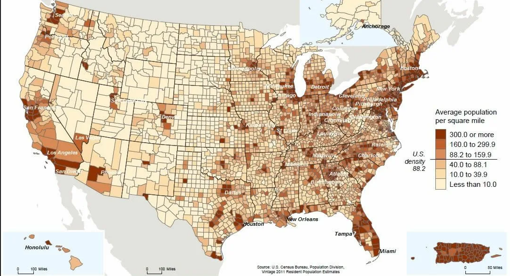
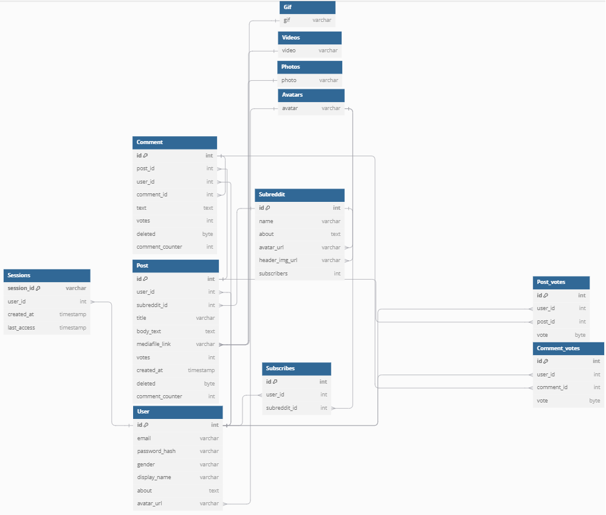
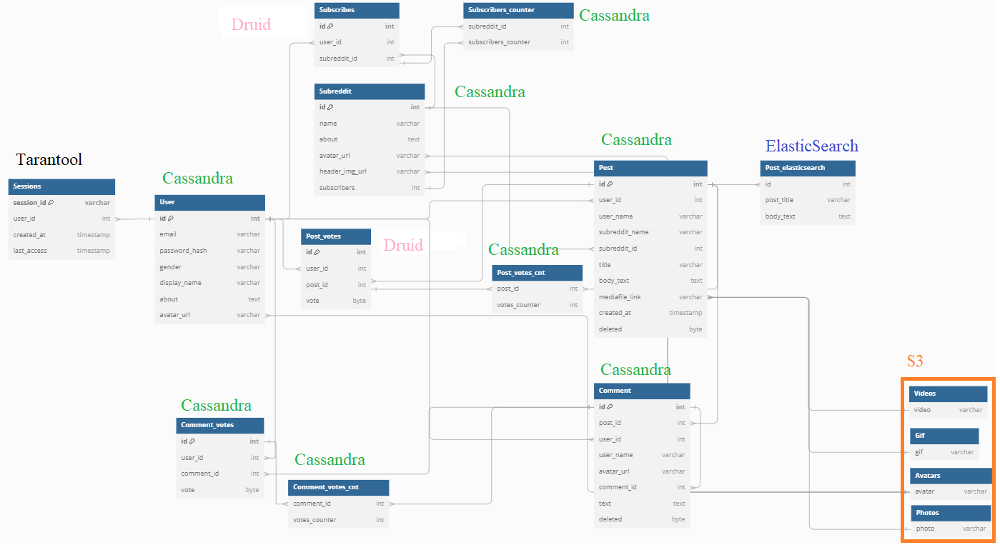

# highload

## [Reddit](https://www.reddit.com/)

* ### [1. Тема, целевая аудитория](#1)
* ### [2. Расчёт нагрузки](#2)
* ### [3. Глобальная балансировка нагрузки](#3)
* ### [4. Локальная балансировка нагрузки](#4)
* ### [5. Логическая схема БД](#5)
* ### [6. Физическая схема БД.](#6)
### 1. Тема и целевая аудитория 

**Reddit** является популярным сайтом, на котором пользователи могут создавать посты, участвовать в обсуждениях, подписываться на каналы. Ближайшие аналоги Reddit'а - Lemmy, Quora, 4chan[1].
Ежедневная аудитория Reddit'а состовляет 70 миллионов, при этом большая часть активных пользователей - 47% (26.4 млн) жители США [2].

Распределение пользователей по странам:
| Страна  | Процентное соотношение |
|---------|-----------------------:|
|США  |	47.8%                      |
|Великобритания  |	7.6%           |
|Канада  |	7.6%                   |
|Австралия    |	7.6%               |
|Германия    |	7.6%               |
|Остальные    |	29.9%              |

Распределение пользователей по возрастам:
| Возраст | Процентное соотношение |
|---------|-----------------------:|
|18 – 29  |	36%                    |
|30 – 49  |	22%                    |
|50 – 64  |	10%                    |
|65+      |	3%                     |

MVP функционал:
1. Создание и управление постами.
2. Сообщества
3. Комментарии.
4. Система голосования/оценки.
5. Выдача ленты контента.
6. Поиск постов.
7. Регистрация.

Ключевые продуктовые решения:
1. Система голосования, влияющая на порядок отображения.
2. Генерирование ленты с учетом предпочтений пользователя.
3. Уведомление пользователя о новых постах в сообщетсвах, ответах.

Список источников:
1. [19 best sites like Reddit 2024](https://rigorousthemes.com/blog/best-reddit-alternatives/)
2. [14+ Reddit Statistics For 2024](https://www.demandsage.com/reddit-statistics/).

### 2. Расчет нагрузки 

Продуктовые метрики:
1. Месячная аудитория (MAU) - 2.306 миллиарда [1],
2. Дневная аудитория (DAU) - 62.24 миллиона [1],
3. Для пользователей не предусмотрено выделение личного пространства на диске.
4. Согласно различным источникам [2] [3] [4], зарегистрированные пользователи в среднем проводят 20 минут на площадке, при этом просматривая 2.84 страницы [4]. Одна страница содержит 25 новостей (Пример запроса, выдающего [ленту](https://www.reddit.com/svc/shreddit/feeds/popular-feed)). В среднем лента весит 25 МБ, то есть 1 пост (с медиаконтентом) весит 1 МБ. За год публикуется порядка 2-ух миллиардов комментариев [3], то есть в среднем пользователь в месяц публиукет 0.09 комментарий, в день это 0.003. Согласно [5] каждый месяц создаётся около 11 млн постов, это в среднем 0,00016 постов на пользователя в день. Согласно [3] в год регистрируется порядка 50 миллиардов голосований, это 1,8 оценок в день на пользователя. Комментарии также загружаются страницами. В страницу комментариев входят также пользователи и их данные (аватар, имя). Предположим, что пользователь в день также загружает 3 страницы комментариев, средний вес которой 13 КБ (измерено по запросу), вес одного комментария в среднем 0.5 КБ, производит 0.5 запросов поиска и 1 раз посещает сообщество в день, а также подписывается (или отписывается) на сообшество 1 раз в месяц. 

Среднее количество действий пользователя по типам в день (единиц в день):
|Действие|Количество в день|
| ------ | -------- |
| Создание поста | 0.00016 |
| Создание сообщества | ~0 |
| Посещение сообщетсва | 1 |
| Подписка/отписка на сообщество | 0.03 |
| Комментирование | 0.003 |
| Оценка | 1.8 |
| Выдача ленты контента | 2.84 |
| Поиск постов | 0.5 |
| Регистрация | ~0 |
| Загрузка постов | 71 |
| Загрузка комментариев | 3 страницы (~60 комментариев) |

Технические метрики:
1. Существенными блоками данных являются аккаунты пользователей и перечисленные ранее посты, комментарии и оценки. Аккаунт содеаржит аватар (80 КБ), описание, подписки, положим, что вся информация о пользователе требует в стреднем 90 КБ. Положим, что в среднем текст поста состовляет 500 знаков, фото занимает 50 КБ, gif - 200 КБ, видео ~750 КБ. 

Размер оценки: для хранения данных используется 16-байтный uuid. Итого для оценки используется uuid пользователя и сущности и boolean (допустим, boolean весит 1 байт). Итого одна оценка весит 33 байта.

| Блок | Штук | Вес | Всего |
| ---- | ---- | --- | ----- |
| Посты (всего) | 11 000 000 [5] * 12 * (2024-2005) = 2 508 000 000| 1 МБ | ~2 394 ТБ |
| Текст поста | ~ количесвто постов | 0.5 КБ | ~1.2 ТБ |
| Фото поста | ~0.6 постов | ~85 КБ | ~120 ТБ |
| GIF поста | ~0.4 постов | 512 КБ | ~478.8 ТБ |
| Видео поста | ~0.1 постов | 7.5 МБ | ~1 800 ТБ |
| Комментарии | 2e9 * (2024-2005) = 38e9| 0.25КБ | ~8.85 ТБ |
| Оценки | 50e9 * (2024-2005) = 0.95e12 | 33 Б | ~28.5 ТБ |
| Аккаунты | 0.5e9[2] | 90КБ | ~45ТБ |

Общий объём хранимый данных ~2 500 ТБ.

2. Сетевой трафик

|  Тип  | Нагрузка для одного пользователя  | Общая (в сутки)   | Сердняя (в секунду)   | Пиковая (в секунду) (x5)  |
| ---   | --------------------------------  | -------------     | -------------------   | ---                       |
| Загрузка ленты постов | 2.84 * 25 * 1МБ   | 4 200 ТБ          | 51.2 ГБ               | 256 ГБ                    |
| Создать пост          | 0.00016 * 1МБ     | 0.01 ТБ           | 0.000123 ГБ           | 0.0006 ГБ                 |
| Подписка на сообщество| 0.003 * 0.1КБ     | 0.00002 ТБ        | 0.3 КБ                | 1.5 КБ                    |
| Загрузить комментарии | 3 * 60 * 0.25КБ   | ~2.6 ТБ           | 0.03 ГБ               | 0.15 ГБ                   |
| Оценка                | 1.8 * 0.1КБ       | 0.01 ТБ           | 0.0001 ГБ             | 0.0005 ГБ                 |

Суммарная нагрузка в сутки - 4 203 ТБ, в секунду - 51.5 ГБ, пиковая в секунду - 257.7 ГБ

3. RPS.

| Блок | На одного пользователя в сутки | Итого в секунду средний   | Итого в секунду пиковый (x5)  |
| ---- | ----                           | ---                       | ---                           |
| Загрузка ленты постов | 2.84          | ~2 000                    | 10 000                        | 
| Загрузить комментарии | 3             | ~2 200                    | 11 000                        |
| Поиск                 | 0.5           | ~360                      | 1 800                         |
| Создание поста        | 0.00016       | ~0.12                     | 0.6                           |
| Загрузить сообщество  | 1             | ~720                      | 3 600                         |
| Комментировать        | 0.003         | ~2.2                      | 11                            | 
|Оценить                | 1.8           | ~1 300                    | 6 500                         |
|Итого                  | 9.2           | ~6 600                    | ~33 000                       |

4. Прирост.

Прирост основных сущностей был описан в пункте 4 продуктовых метрик: ~ 167 млн комментариев, 11 млн постов, ~ 4 167 млн оценок ежемесечно. По предположению [2] к 2028 году будет 556 миллионов зарегистрированных пользователей, то есть прирост ~1.15 млн в месяц (сейчас начситывается 500 млн). На основе этих данных составлена таблица месячного прироста

| Сущность  | Прирост (штуки)   | Вес   | Прирост (данные)  |
| --------- | ----------------- | ----- | ----------------  |
| Комментарии | 167e6        | 0.25 КБ  | 0.04 ГБ           |
| Посты     | 11e6              | 1 МБ  | 10 750 ГБ         |
| Оценки    | 4.167e6           | 33 Б  | 0.13 ГБ           |
| Пользователи | 1.15e6         | 90 КБ | 0.1 ГБ            |

Итого прирость данных составляет 10 750.27 ГБ ежемесячно.

Список источников:
1. [Reddit User Base & Growth Statistics: How Many People Use Reddit? (2024)](https://www.bankmycell.com/blog/number-of-reddit-users/)
2. [Reddit User Age, Gender, & Demographics (2024)](https://explodingtopics.com/blog/reddit-users)
3. [Significant Reddit Statistics 2024: Facts & Figures, Usage Statistics](https://bytegain.com/reddit-statistics/)
4. [Latest Reddit Statistics: The SECRET Social Media Platform](https://www.ileeline.com/reddit-statistics/)
5. [20+ Riveting Reddit Statistics [2023]](https://www.zippia.com/advice/reddit-statistics/)
6. [How many subreddits are on Reddit?](https://wegotthiscovered.com/social-media/how-many-subreddits-are-on-reddit/)

### 3. Глобальная балансировка нагрузки 

1. Распределение трафика на группы.

Трафик можно разделить на 2 основные группы: выдача медиа (посты (в том числе фото, видео, gif), комментарии), и остальное. Поскольку Reddit подразумевает в основном выдачу статики (текст, фото, видео), то для жтих целей разумно использовать CDN. Для CDN можно использовать поддомен или отдельный домен, или использовать готовые решения, например, Amazon CloudFront. Для создания постов, комментариев, аккаунтов, подписок CDN не потребуется.

2. Расположение датацентров.

Распределение RPS по странам:

| Страна    | RPS (в секунду)       |
|---------  |----------------------:|
|США        |	3150                |
|Великобритания  |	500             |
|Канада     |	500                 |
|Австралия  |	500                 |
|Германия   |	500                 |
|Остальные  |	1970                |

США. Расположим датацентры в США с учётом плотности населения:

На карте видно, что заселение на восточном побережье и части западного побережья плотнее, чем в центральной части. Расположим датацентры с учётом плотности населения и карты расположения АЭС для обеспечения стабильной энергией [1]. Так же расопложим несколько датацентров в регионах, чтобы распределять нагрузку внутри страны эффективно при помощи BGP Anycast.

Всего получилось 11 датацентров.

Для остальных стран будем придерживаться того же принципа.

Великобритания.

Германия.

Франция.

Канада.

Австралия.

Весь мир.

[Примерная карта датацентров](https://yandex.ru/maps/?ll=38.353354%2C25.216488&mode=usermaps&source=constructorLink&um=constructor%3A6f3f0d5f20e86332fae7f1b4a40f52184158eb986e23d8d44e151d4904ef01a8&z=3)

3. Схема глобальной балансировки.

Для глобальной балансировки помимо уже используемого BGP Anycast предлагаю использовать Geo-Based DNS для стран с наиболее большей аудиторией и Latency-based DNS для отдаленных стран, чтобы обеспечить отказоустойчивость. 

Список источников:
1. [АЭС США](https://www.google.ru/maps/d/viewer?mid=1umnxGzgI_zQ1PKH4nZzWwtou6OQ&hl=ru&ll=41.805326407227724%2C-76.13027336795477&z=7)

### 4. Локальная балансировка 

1. Выбрать схемы балансировки для входящих и межсервисных запросов.

Межсервисные запросы.

Для балансировки межсервисных запросов используется балансировка L4 Virtual Server via IP Tunneling, поскольку это не будет нагружать балансер как при использовании схемы Virtual Server via NAT. Также данный вид балансировки позволяет располагать сервера в разных физических сетях.

Входяие запросы.

Поскольку Reddit - сервис, на котором основной задачей является выдача статики (медиаконтента), то для входящих запросов используется балансировка L7 при помощи Ngnix. Ngnix будет использоваться как промежуточный прокси. Таким образом, будет обеспечиваться равномерная нагрузка на сервера при помощи least-connection. При это Ngnix будет выполнять ещё ряд важных функций, такие как: отдача статики, кеширование запросов, сжатие gzip, решение проблемы медленных клинтов и терминация SSL.

2. Продумать схему отказоустойчивости.

Для обеспечения отказоустойчивости используется keepalived, который позволяет обеспечить резервирование нод и отслеживать состояние узлов системы.

Также для обеспечения отказоустойчивости Ngnix балансировщики дублированы, тем самым при отказе одного балансировщика, его заменяет дублирующий.
Также можно на Ngnix использованы разлчные настройки для разных типов запросов, чтобы снизить ожидание разрыва соединения при нерабочем сервере, при этом не прерывая "живые" соединения.

Предлагается также производить аркестрирование серверов при помощи Kubernetes, осуществляя auto-scaling

3. Рассчитать нагрузку по терминации SSL

Терминация SSL будет происходить на Ngnix балансировщике, далее запросы на сервера будут передаваться по http. Чтобы снизить нагрузку по терминации SSL предлагается использовать session ticket для хранения состояния сессии на клиенте 

### 5. Логическая схема БД. 

[Схема](https://dbdiagram.io/d/6702ce66fb079c7ebd812656)

Описание таблиц:

| Название таблицы  | Описание  |
| ----------------- | --------- |
| User              | Таблица для хранения информации о пользователе |
| Sessions          | Таблица для хранения сессий                   |
| Subscribes        | Таблица для хранения подписок пользователя на Subreddit |
| Subreddit         | Таблица для хранения данных о сообществе (Subreddit) |
| Post              | Таблица для хранения информации о посте |
| Post votes        | Таблица для хранения оценок постов |
| Comment           | Таблица для хранения комментариев |
| Comment votes     | Таблица для хранения оценок комментариев |
| Videos            | S3 для видео  |
| Photos            | S3 для фото   |
| Avatars           | S3 для аватаров |
| Gif               | S3 для gif    |

Медиафайлы предлагается хранить в S3.

Кешированию подвергать популярные посты и использовать буферы для запросов на запись, таких как комментарии и оценки.

Размеры таблиц:

| Таблица   | Размер для одной записи   | Кол-во записей    | Всего |
| --------- | ------------------------- | ------------      | ----- |
| User      | (4:id + 256:email + 60:password + 6:gender + 50:display_name + 200:about + 256:avatar_url)Б = 832 Б | 0.5e9 | 387,43 ГБ |
| Sessions  | (256:session_id + 4:user_id + 8:created_at + 8:last_access)Б = 276Б | 0.5e9 | 128,5 ГБ |
| Subscribes| (4:id + 4: user_id + 4:subreddit_id)Б = 12 Б | ~2.5e9 | 27,94 ГБ |
| Subreddit | (4:id + 500:about + name:21 + 256:avatar_url + 256:header_img_url + 4:subscribers)Б = 1041 Б | 10e6 | 0,97 ГБ |
| Post      | (4:id + 4:user_id + 4:subreddit_id + 300:title + 500:body_text + 256:mediafile_link + 4:votes + 8:created_at + 1:deleted + 4:comment_count)Б | 2.5e9 | 2 514 ГБ |
| Comment   | (4:id + 4:user_id + 4:post_id + 4:comment_id + 500:text + 1:deleted + 4:comment_count)Б = 516Б | 38e9 | 18 261 ГБ |
| Post_votes| (4:id + 4:user_id + 4:post_id + 1:vote)Б = 13Б | 550e9 | 6 659 ГБ |
| Comment_votes| (4:id + 4:user_id + 4:comment_id + 1:vote)Б = 13Б | 400e9 | 4 843 ГБ |
| Videos            | 750 КБ  | 2.5e8 | 175 ТБ |
| Photos            | 50 КБ   | 1.5e9 | 20 ТБ |
| Avatars           | 50 КБ   | 0.5e9 | 6.6 ТБ |
| Gif               | 200 КБ  | 1e9   | 954 ГБ |

Нагрузка на чтение/запись:
| Название таблицы  | RPS всего |Тип нагрузки   |
| ----------------  | -----     |-------------- |
| User              | 2200: Загрузить комментарии + 2.2:комментировать + 1300 оценить + 0.12:создание поста = 3502.32 | Чтение |
| Sessions          | 717.6 (из DAU) | Чтение > Запись |
| Subscribes        | <<1       | Запись\Чтение |
| Subreddit         | 2000:загрузка ленты постов + 720:Загрузить сообщество + 0.12:создание поста = 2720.12 | Чтение |
| Post              | 2000:Загрузка ленты постов + 2.2:комментировать + 800:оценить + 0.12:создание поста = 2802.32 | Чтение >> Запись |
| Comment           | 2200:загрузить комментарии + 2.2:комментировать + 500:оценить = 2702.2 | Чтение >> Запись |
| Post_votes        | 800:оценить | Запись >> Чтение|
| Comment_votes     | 500:оценить | Запись >> Чтение|  

### 6. Физическая схема БД. 

Хранение всей статической информации реализовано при помощи S3 хранилища. Хранение сессий реализовано при помощи tarantool, поскольку является in-memory БД, позволяет обрабатывать запросы с высокой скоростью записи и чтения и имеет возможность восстановиться в отличие от Redis. 
Основные сущности (Пользователи, Подписки, Посты, Комментарии, Сабреддиты) хранятся при помощи PostgreSQL, поскольку данные таблицы требуют высокой консистентности. Для данных таблиц основная нагрузка это чтение, поэтому необходимо произвести репликацию пользователей, сабреддитов, постов и комментариев. Также будет применятся шардирование по временным меткам. 
Основной нагрузкой для оценок в свою очередь является запись. Поэтому в данном случае важно в первую очередь шардирование. Для хранения данных таблиц будет использована Cassandra, поскольку она уже имеет встроенный механизм горизонтального масштабирования.

Наиболее важными индексами являются оценка и дата создания в таблице постов и оценка, id поста и comment_id в таблице комментариев. В случае с постами ускорит выделение наиболее популярных и наиболее новых постов. В случае с комментариями позволит выстраивать очередность комментариев по популярности, а также ускорить нахождение ответов на комментарии.

Таблицы.

Индексы:
| Название таблицы  | Индексируемое поле    |
| ----------------  | --------------------- |
| Post              | votes, vreated_at     |
| Comment           | post_id, votes, comment_id |
| User              | display_name          |
| Post_votes        | post_id               |
| Comment_votes     | comment_id            |
| Subscribes        | user_id               |

Денормализация:
| Название таблицы  | Применённая денормализация    |
| ----------------  | --------------------- |
| Post & Comment    | Добавление суммы оценок и количества комментариев |

Выбор СУБД
| Название таблиц   | Выбранная СУБД    |
| ----------------  | -------------     |
| Sessions          | Tarantool         |
| Post, Comment, User, Subreddit, Subscribes | PostgreSQL |
| Photos, Avatars, Gif, Videos | S3     |
| Post_votes, Comment_votes | Cassandra |

Шардирование и резервирование:
| Название таблицы  | Шардирование  | Реплицирование    |
| ----------------  | ------------  | ---------------   |
| Post              | Временные метки | Да              |
| Comment           | Временные метки | Да              |
| Comment_votes     | По post_id      | Нет             |
| Post_votes        | По post_id      | Нет             |
| User              | Нет             | Да              |
| Subscribes        | Нет             | Да              | 
| Subreddit         | Нет             | Да              | 
| Sessions          | Нет             | Резирвирование для восстановления данных |

Библиотеки: psycopg2 cassandra-driver tarantool-python Vshard

Балансировка запросов:
PostgreSQL: Pgpool-II (репликация и шардирование)
Cassandra: внутренние механизмы (шардирование)
Tarantool: репликация

Схема резервного копирования:
| Название СУБД     | Схема             |
| ---------------   | -------------     |
| Cassandra         | Snapshot          |
| Tarantool         | Механизмы восстановления данных |
| PostgreSQL        | Дамп              |
| S3                | Полагаться на Amazon S3 |

